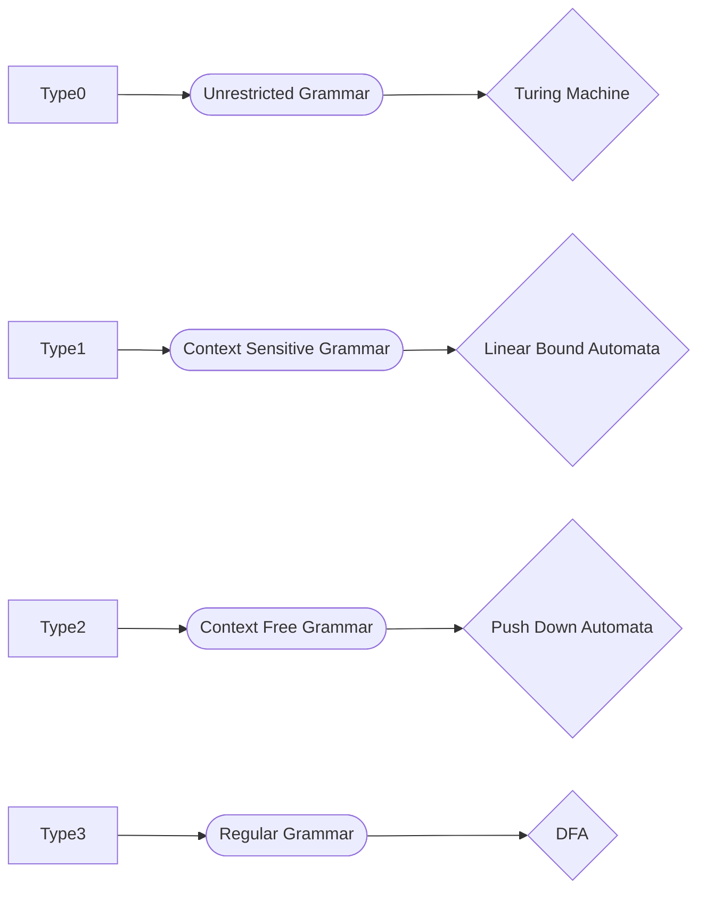

**Types of Grammar**

**type 0**
$$ 
\begin{aligned}
X &\to Y \\
X \space &\epsilon \space \text{(V + T)* V (V + T)*} 
\end{aligned}
$$

type 1
$$
\begin{aligned}
\text{X} &\to \text{Y} \\  
\text{type1} &\ = \text{type0} + | X | \le | Y | \\
\text{X} \space &\epsilon \space \text{(V + T)* V (V + T)*} 
\end{aligned}
$$

type 2
- type 2 = type0 + type1 + (|x| == 1)

type 3
- type 3 = type 0 + type 1 + type 2 + Condition
condition:
$$
\begin{aligned}
\text{Y} \space &\epsilon \space \text{(V + T)*} \\
\text{Y} \space &\ = \space \text{VT* + T*} \\
&\ \text{OR} \\
\text{Y} \space &\ = \space \text{T* + T*V} \\
\end{aligned}
$$

-------

**Ambiguous Grammar**: For a given grammar there is a string which has 2 LMD or 2 RMD or 2 parse trees then that grammar is Ambiguous Grammar

**RMD**: Right Most Derivation
**LMD**: Left Most Derivation

Grammar:
$$
\begin{aligned}
\text{E} &\to \text{E + E} \mid \text{E * E} \mid \text{id} 
\end{aligned}
$$
this is an Ambiguous Grammar since it has 2LMD for the string **id+id\*id**

-------

**Left Recursive Grammar**: A type of Grammar where a variable's production has the same variable occurring in the first position. 
eg:
$$
\begin{aligned}
\text{E} &\to \text{E + id} \mid \text{id}
\end{aligned}
$$
Same for Right Recursive Grammar but the same variable is in the last position of it's production

-------

 **Precidence**: Preference of some operators over other.
 order: (^) > (* , /) > (+, -)
 **Associativity**: When precidence is same then Associativity is checked
 ^ -> Right to left associative (right recursion is used)
\*,\ -> left to right associative (left recursion is used)
 +,- -> left to right associative (left recursion is used)

--------

**NOTE**
Top down parser doest not support left recursion.

**Removing Left recursion**o:
Formula:

Given:
$$
\begin{aligned}
\text{S} &\to \text{Sa1} \mid \text{Sa2} \mid \text{Sa3} \mid \text{Sa4} \mid \text{Sa5} \mid \text{....} \\ 
\text{S} &\to \text{b1} \mid \text{b2} \mid \text{b3} \mid \text{b4} \mid \text{b5} \mid \text{....} 
\end{aligned}
$$

 After removing:
 $$
\begin{aligned} 
\text{S} &\to \text{b1A'} \mid \text{b2A'} \mid \text{b3A'} \mid \text{b4A'} \mid \text{b5A'} \mid \text{....} \\
\text{A'} &\to \epsilon \mid \text{a1A'} \mid \text{a2A'} \mid \text{a3A'} \mid \text{a4A'} \mid \text{a5A'} \mid \text{....}
\end{aligned} 
 $$
 
------ 

**Left Factoring**
- factoring common tokens/variable and introducing a new variable with extended productions

--------
