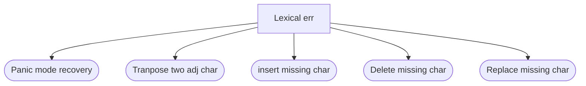

## Role:
- Error Detection
- Error Reporting
- Error Recovery

## Lexical Errors
- Err if Identifier is way too long: Taken care when Practically implementing DFA/Fin State machine
	- C++ -> 2048 sig characters
	- C -> 38/247 sig characters
	- python -> 79 sig characters
- Exceeding length of numeric constants
- Ill - formed number constant: eg: 10912$13
- Illegal character that are not included in the design of the analyzer eg: 1512d;$

## Lexical Err recovery

- Panic Mode Recovery: Here if an error is encountered then subsequent characters are skipped until a valid delimiter is found.
- Transposing two adjacent character: whlie -> while
- Insert a missing character: eg: it num; -> int num:
- Deleting an extra character: eg: intt num; -> int num:
- repalcing a character: eg: itt num; -> int num:

## Syntax Error
- missing, extra, wrong token
- imbalanced delimiter

## Syntax Err Recovery

- Panic Mode Recovery: Ignores the err stream of token until a delimiter or a declaration is found
- Phrase level Recovery: 
	- Adding a token
	- updating a token
	- deleting a token
- Error Production
	- Adding an error production in the specified grammar of the language
- Symbol table recovery