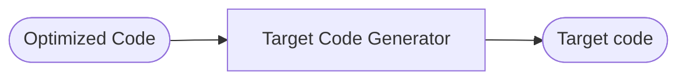

# Introduction

Interaction between diff components: [[Interactions.canvas]]

Pre Processor Directive: 
- Instruction that are processed by PreProcessor.
- used for Macro definitions, File Inclusion etc.
```
#include <stdio.h>
```

## Underlying architecture:


### Preprocessor
- Processes Preprocessor Directives  
- File Inclusion
- Macros 
- Extends the source code before giving it to the compiler
- Input: HLL
- Output: Pure HLL
### Compiler
- Compiler the code into .asm file "Assembly Language"
- Input: Pure HLL
- Output: Assembly Language

### Assembler
- Input: Assembly Lang
- Output: Relocatable Machine Code (given sequence address before the code is loaded into the memory)
```
	i+0 00001001
	i+1 10010100
	i+2 01100010
```

### Linker/Loader
 - Loads the **relocatable machine code** into the *ram*
 - generate **Absolute Machine Code**

## Compiler Architecture


# Lexical Analysis

- taken care by Lexical Analyzer
- input: *Lexems*
- output: *Tokens*
- depends on type-3 grammar *Regular Grammar*

# Syntax Analysis

- Uses CFG to create **Parse Tree** from the list of Tokens given by *Lexical Analyzer*
E.g.
$$
\begin{aligned}
\text{S} &\to \text{id = E ;} \\  
\text{E} &\to \text{T} \mid \text{E * T} \\  
\text{T} &\to \text{T * F} \mid \text{id}
\end{aligned}
$$
- if the yield of the parse tree and the provided stream of tokes match then no err by the analyzer

# Semantic Analysis

- input: *Parse tree* from Syntax Analyzer
- output: Semantically verified *parse tree*.
- checks:
	- type checking
	- Area bound checking
	- scope of a variable
- logical analysis of the parse tree
- handles cases like:
	- same name declaration
	- out of scope usage
	- unused variables
	- type error 
	etc

# Intermediate Code Generation

- input: Parse tree
- output: intermediate Code (typically 3 address code) 

END of frontend

------------

# Code Optimization

- can be machine dependent
- can be machine independent
- optimization of the TAC that we got from previous step

# Target Code Output


# Symbol Table Manager
- Manages the Symbol that are gathered from *Analysis Phase* and gives them to *Synthesis Phase*
- These Symbols are stored in *Symbol Table*

# Symbol Table
- It is a type of Data Structure
- It stores information about:
	- Variable and Function names
	- Interfaces
	- Classes
	- Objects etc
- Gathers it's data from Analysis Stage
- Data is consumed in the Synthesis Stages
$$
\begin{aligned}
&\text{int count ;} \\
&\text{char x[ ] = "Hello World" ;} \\
\end{aligned}
$$
$$
\begin{array}{c | c | c | c | c | c | c}
\text{Name} & \text{Type} & \text{Size} & \text{Dimension} & \text{Line of Dec} & \text{line of Usage} & \text{Address} \\ 
\text{count} & \text{int} & \text{4} & \text{0} & \text{--} & \text{--} & \text{--} \\
\text{Hello World} & \text{char} & \text{11} & \text{1} & \text{--} & \text{--} & \text{--}
\end{array}
$$
- operations: Insert(), lookup(), set(), reset()