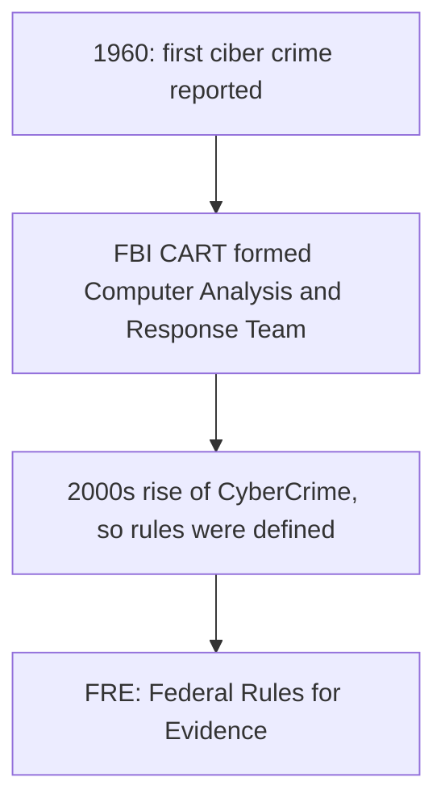

Digital Forensics:
1. Application of mathematics and computer sci for legal purpose involving analysis of digital evidence after 
	1. Proper Authority
	2. Validation Using Mathematics (Hash function)
	3. Chain of Custody
	4. Repeatability
	5. Reporting
	6. Usage of Forensic Tools
	7. Without tampering the evidence
2. It is a process of Gathering, Processing, Analyzing and presenting digital evidence in a legally acceptable manner which includes
	1. Criminal Investigations
	2. Civil Investigations
	3. Authority Investigations
3. Used to analyze data retrieved from hard drive or any other externam media.
4. Objectives:
	1. Examining digital evidence
	2. preserving the integrity of digital evidence
	3. Reporting the findings derived from digital evidence
	4. Performing Analysis on the evidence
	5. main chain of custody
	6. present evidence in court
	7. Recovering hidden/deleted information
	8. following court approved methods for handling, preserving and recovering data

Digital Evidence:
1. It is referred to a probative information which is stored and transmitted in the form of binary information. 
2. Can reside in:
	1. Computers
	2. Hard disks
	3. RAM
	4. Servers
	5. USB/DVD/CD
	6. Mobile Devices
	7. Cloud
3. It includes both active and latent data.
4. Characteristics:
	1. Fragile and easily Tampered
	2. Can be easily copied using bit by bit imaging
	3. Needs proper validation using hash function
	4. proper chain of custody
	5. can be present in multiple devices
5. Types of Evidence:
	1. Inculpatory Evidence : Incriminating evidence
	2. Exculpatory Evidence : Evidence that can clear the suspect

History:

Difference between digital Forensics and Data recover [[DF vs Data Recovery]]

Network Forensics:
1. It deals with attacks and intrusions happening over the network.
2. Collecting information of how an attacker might have access the network, and all the files they might have tampered, deleted or created.
3. Examining user logs to see any suspicious log in, URL they might have accessed, How they might have logged in and from what location.

Private Vs Public Investigations
Public:
1. Involves Government Agencies like municipal, County, Federal law enforcement bodies
2. Here every government agencies are suppose to act according to their jurisdiction written in the state's constitution
3. The guilty party is sentenced to jail, community service etc.

private:
1. Investigations which are conducted by private companies.
2. Involves cases like:
	1. Policy violation
	2. Private Espionage
3. Usually gets settled via compensation

Some types of serious computer crimes:
1. Sexual exploitation of minors
2. Missing children and adults
3. Drug dealers store info of their transactions on computers 
4. Network Intrusions

Legal Process while investigating a cybercrime 
1. The procedure depends of multiple factors
	1. Local Customs
	2. Legislative Standards
	3. Evidence rules and regulation
2. A criminal case generally follow 3 steps
	1. Complaint
	2. Investigation
	3. Prosecution

### Public Sector Investigation:
1. A general process a public sector Investigations:
	1. Criminal investigations starts when someone witnesses a criminal or finds evidence of it.
	2. The witness makes allegations and the police interviews them and documents that to generate a report stating that accusation.
	3. The report is then passed and the management start an investigation
	4. Here historical data is also used in order to find patters that match with the description of the crime. 
	5. there are two categories every on field officer is assigned:
		1. Digital Evidence First Responder
			1. Has training and skill to reach the crime scene first and asses the situation while preserving any evidence that is found.
		2. Digital Evidence Specialist
			1. Has training and skills to analyze found evidence from the crime scene and takes decision when other investigative specialist's help is needed.
2. Analysis of digital aspects	
	1. Start with analyzing the scope of the case like, OSs, Network, Drives, Peripheral Devices. 
	2. Then see whether resources are available to process these evidence 
	3. Then you check is the tools are available and if you need outside assistance.
	4. Then process the gather data and build a case
	5. The forward that to the prosecutor 
	6. Present the reports with collected evidence to the government's attorney
	7. Then an affidavit is to be created with all the evidence and notorized of its authenticity to get a ***Search Warent***
	8. With that Search Warent the Digital Evidence First Responder the search the suspect's property in order to collect more evidences.
	
### Private Sector Investigations
1. It involves conduction an investigations from a Private Company and their lawyers that includes Policy Violations, and cases like wrongful termination.
2. Here the private investigator's job is to minimize the hindrance caused to the business as low as possible, because private companies mainly focuses on their business.
3. Companies try to minimize the litigation process that can sum up to a large compensation.
4. Some private sector crimes involve:
	1. E-Mail harassment
	2. Network Intrusion
	3. Privacy Intrusion
	4. White Collar fraud: Falsification of data, Embezzlement, Sabotage
	5. Industrial Espionage
5. Publishing Company Policies
	1. A well defined and easy to follow rules and policies can reduce the risk of litigation
	2. Most imp policies are: "Acceptable use Policy"
	3. A line of Authority is provided with the policy that states who is responsible for investigations, evidence collection and access to the evidence
	4. Other way to minimize litigation is to show warning banners when every the user connects to the companies intranet, network or VPN
	5. this shows the companies reserve rights to check you system under an ongoing investigation.
	6. Borders and the country's jurisdiction also play a huge role for a crime which requires sending the data overseas

### work station ppt
1. Accreditation by ANSI-ASQ National Accreditation Board (ANAB)
	1. Provides accreditation for crime and forensic Lab worldwide 
	2. Audits lab functions and procedures
2. What is a workstation:
	1. A place where all the analysis of investigations
	2. Has a safe and secure cabinet for storing evidence
	3. Contains all the hardware, software and equipments

3. Mainly 2 types of people in a forensics lab
	1. Lab manager
		1. set up processes for managing cases
		2. Provides a safe and secure place from staff members and evidence
		3. Promote ethics and morals between staff members
		4. Plan updates to the whole work station
		5. Plan meeting for consensus on various important decision.
		6. maintain financial responsibilities for investigative needs. 
		7. Monitor lab policies.
		
	2. Staff Member
		1. Have knowledge of software and hardware
		2. Use their critical thinking
		3. Document everything they do
		4. their work is reviewed regularly by the lab manager
		
4. Budget planning
	To create a budget for the lab these things should be kept in mind:
	1. break costs down into monthly, quarterly and annual expenses 
	2. Expenses for LAB includes:
		1. Hardware
		2. Software
		3. Lab facility
		4. Training personel
	3. Use past criminal records to estimate the resource needs
	4. Calculate the No of Cases the lab's investigators can take 
	5. Take into consideration the advancement in technology
	6. use statistics in order to predict a rough no of computer crimes in the future
	7. Using this try to estimate the resource and expenses that might be needed