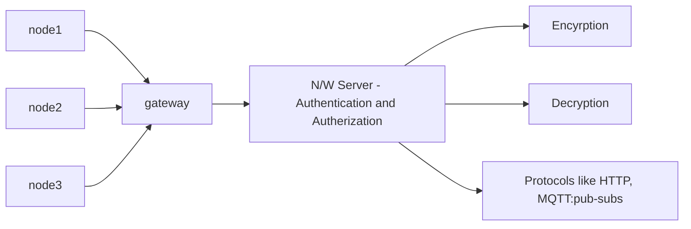

Used for IOT

## Features
- LORA: Longe Range
- one Hop Communication
- Low pow Wide Area Network (LPWAN)
- Ex: Electricity metre reading
- Came in 2016 

Nodes are of diff classes:
1. A : Sleep
2. B : Greater receive window
3. C : always on
	1. No suitable for battery limited operations

Variant: LORA - Blink
1. Only diff: Multi hop protocol